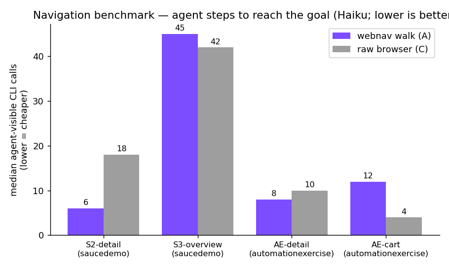
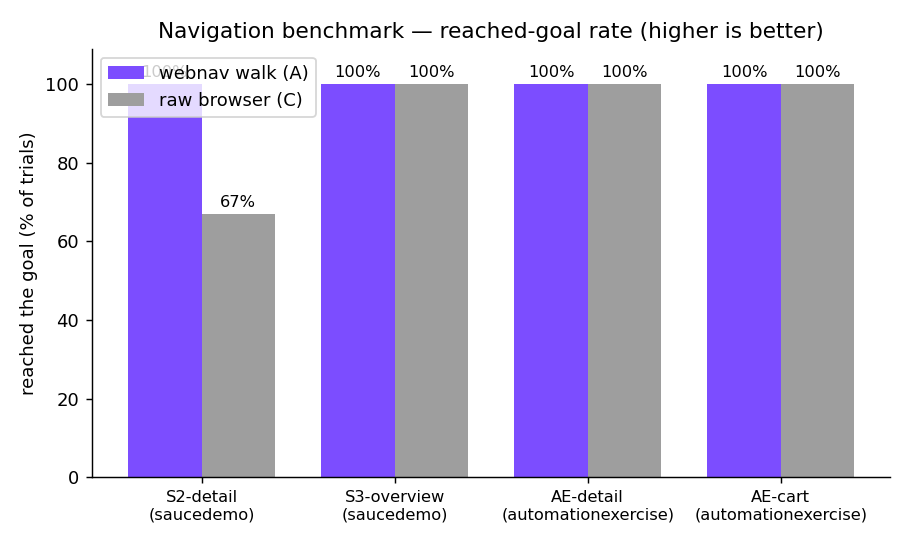

# webnav navigation benchmark — does a remembered route beat ad-hoc driving?

**The headline number is not the point — the methodology and the honest spread are.** This report
documents what we measure, how, the exact per-task numbers, the graphs, and where webnav **does not**
win. If you only remember one thing: *webnav cuts agent steps on **deep, reliably-walked** routes
(a clean 3× on the deepest saucedemo task); on shallow routes, or when the walk isn't actually used,
it ties or loses.* We report all of it.

Raw per-run data: [`results/data/nav-v2.json`](results/data/nav-v2.json) · charts regenerated by
[`chart.py`](chart.py) (`python3 bench/chart.py`) · design spec:
[`../docs/superpowers/specs/2026-06-13-navigation-benchmark-v2-design.md`](../docs/superpowers/specs/2026-06-13-navigation-benchmark-v2-design.md).

## What is being measured

**The claim, as a falsifiable hypothesis:** *for a multi-step route an agent travels repeatedly,
recalling the route with `webnav walk` costs the agent fewer reasoning steps (and so fewer tokens and
less wall-clock) than having the agent ad-hoc-drive the same browser, while reaching the goal at least
as reliably.* If the numbers don't separate on deep routes, the hypothesis is wrong — and we say so.

**Two arms, same model, same browser underneath** (the only difference is whether a *remembered route*
drives it):

| Arm | Instrument | What the agent does |
|---|---|---|
| **A — webnav walk** | `webnav walk` / `walk-resume` | "take me to goal G"; reasons only at genuine forks |
| **C — raw browser** | `webnav use navigate/snapshot/click/type` (no map) | drives every step: snapshot → read → pick ref → act → repeat |

**Metrics**

- **Agent-visible CLI calls** (the headline cost signal): how many tool calls the agent issues to reach
  the goal. Fewer is cheaper, because each `snapshot`/drive step typically ingests a full page snapshot
  into the agent's context — the exact token cost webnav exists to avoid. We report the **median over
  trials** (LLM runs vary) plus the range.
- **Reached-goal rate**: did the agent arrive at the target state with live evidence (verified from its
  trace + the answer it returned), as a % of trials.
- **Walk-used (arm A only, where captured)**: did the agent actually use `webnav walk`, or fall back to
  manual driving? When it falls back, arm A collapses into arm C — a *discoverability* finding, not a
  capability one. Reported separately so a collapse isn't mistaken for a tie.

**Method:** both arms run as **Haiku** subagents (`claude-haiku-4-5` — the deliberate dogfood: a cheap
agent + a deterministic map should beat an expensive agent winging it). Same task prompt except the one
instrument paragraph; credentials pre-stored locally (never in the map); distinct browser sessions per
arm; success scored by an **anonymized judge** (arm identity hidden) against a per-task rubric. N = 3
trials per (task, arm) on saucedemo/automationexercise.

## Results

### Agent steps to reach the goal (lower is better)



### Reached-goal rate (higher is better)



### Per-task numbers

| Site | Task | Hops | Arm A median calls (range) | Arm C median calls (range) | A reached | C reached |
|---|---|---|---|---|---|---|
| saucedemo | **S2 — product detail** | 2 | **6** (5–10) | **18** (14–28) | 3/3 | 2/3 |
| saucedemo | S3 — checkout overview | 4 | 45 (28–52) | 42 (6–127) | 3/3 | 3/3 |
| automationexercise | AE-detail — product detail | ~2 | 8 (8–15) | 10 (8–12) | 3/3 | 3/3 |
| automationexercise | AE-cart — cart page | 1 | 12 (4–12) | 4 (4–8) | 3/3 | 3/3 |
| OrangeHRM | O-recruit — recruitment list | 6 | _(pending — run in progress)_ | | | |
| OrangeHRM | O-pim — employee list | 3 | _(pending)_ | | | |

## What the numbers say (honestly)

- **The clean win — saucedemo S2 (the deepest *reliably-walked* route): ~3× fewer steps (6 vs 18) and
  better reliability (3/3 vs 2/3).** This is the hypothesis confirmed: when the walk drives a genuine
  multi-hop route, the agent stops ingesting a snapshot per step.
- **The ties / losses are real and instructive:**
  - *S3 (4-hop checkout): tie (45 vs 42), both arms wildly variable* — because several arm-A agents
    **abandoned the walk and drove manually**, collapsing A into C. The deciding factor was *whether the
    walk was used*, not capability.
  - *automationexercise: no win (AE-detail tie 8 vs 10; AE-cart loss 12 vs 4)* — the routes are shallow
    (1–2 hops, too short for recall to amortize) AND the walk repeatedly failed under the benchmark's own
    concurrent-browser load, so agents correctly fell back to manual. A 1-hop route is no regime for a
    route-memory to win.
- **Where webnav helps is exactly where ad-hoc driving hurts: long, repeated, reliably-walked journeys.**
  On short hops or flaky-walk conditions, an agent driving the raw browser does just as well — and the
  benchmark shows it.

## Honest limitations of this benchmark
- **N = 3** (small; Haiku's strategy choice is itself a variance source). Medians + ranges shown, not
  point claims.
- **The walk-fallback problem dominates the negatives** — the bigger lever right now is walk
  ergonomics/reliability-under-load (agents default to the manual loop; the daemon gets flaky under
  concurrency), not the core idea. Fixing that (and a "bare-continue" resume, R5.1) is the path to a
  cleaner win across more tasks.
- **The judge over-penalizes terse-but-correct answers** in a couple of runs (marks a correct value
  "wrong" for not narrating evidence) — so we lead with tool-calls + reached-goal, the trace-verified
  signals, not the judge verdict.
- **Requires a live browser + network** to reproduce (`playwright-cli` on PATH, sites reachable).

## Reproduce it
The numbers above come from the committed raw data, not hand-typed:
```bash
python3 bench/chart.py          # regenerate the graphs from results/data/nav-v2.json
```
To re-run the live arms yourself, see the harness in [`README.md`](README.md) and the v2 design spec.
